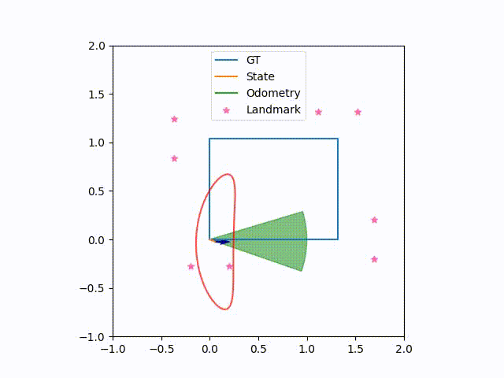

# Project Description
ROB530 - Mobile Robotics Final Project 
Apriltag landmark localization with a Right Invariant Extended Kalman Filter 

Additional Deliverables
==
<ins>Code:</ins> See above 
<ins>Report:</ins> See report/ folder 
<ins>Slides:</ins> See slides/ folder 
<ins>Report video:</ins> https://www.youtube.com/watch?v=al2p-oy7msg 

Dependencies (with tested versions):
==
  Post-processing: 
    - Python (3.8) 
    - OpenCV (4.9) 
    - Scipy (1.10) 
    - Matplotlib (3.1.2) 
    - Numpy (1.24) 

  For Apriltags: 
    - dt-apriltags (>=3.1) 

How to run the code:
==
1. Pull the repository from Github/Gitlab 
2. Run run.py script 
$ python3 run.py 

Referenced Works:
==
This work builds upon existing work, including: 
1. https://mbot.robotics.umich.edu/ (the MBot ecosystem)
2. ROB 530 course staff provided example code and homeworks.

Acknowledgements:
==
This work was made possible through the technical support and teachings of Maani Ghaffari and the rest of the ROB 530 instructional team, to whom we extend great thanks!
